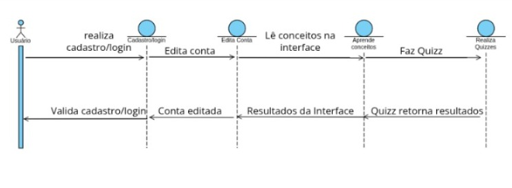

# 📄 Relatório de Engenharia Reversa

---

## 1. 🎯 Introdução

Este relatório documenta o processo de Engenharia Reversa aplicado ao sistema **MindTranslate**. A Engenharia Reversa é um conjunto de técnicas analíticas utilizadas para **compreender um sistema existente** e recuperar requisitos, modelos e estruturas que não foram formalmente documentados.

  <strong><a href="https://mindtranslate-git-main-arnald-lucas-projects.vercel.app">Acessar a Demo Ao Vivo</a></strong>

---

## 2. 📝 Recuperação de Requisitos Funcionais

A recuperação dos **requisitos funcionais** foi realizada por meio da observação e análise detalhada do código, interface e fluxos do sistema. Os requisitos são apresentados na forma de **Histórias do Usuário**, garantindo que refletem fielmente o que o sistema realmente executa.

[Veja aqui as Histórias do Usuário ](./requisitos.md)

## 3. 🏗️ Modelagem Estrutural e Comportamental

### 3.1. Modelagem Estrutural (Diagrama de Classes)

O Diagrama de Classes UML (ou notação equivalente) foi utilizado para visualizar a organização interna do sistema, destacando as **principais classes, atributos, métodos e associações** relevantes.

* **Descrição do Diagrama:** Explicar as classes centrais e como elas se relacionam (associações, heranças, etc.).

### 3.2. Modelagem Comportamental/Interacional

Para representar o comportamento, foi escolhido o **Diagrama de Sequência UML** para ilustrar a interação no sistema.

* **Fluxo Modelado:** O fluxo de interação principal do usuário, desde o login/cadastro até a realização e retorno de resultados de um *quiz*.
* **Descrição do Comportamento:**

O diagrama detalha o fluxo interacional que um **Usuário** percorre dentro do sistema, seguindo estas etapas:

1.  **Acesso e Autenticação:** O fluxo inicia com o **Usuário** interagindo com o objeto `CadastroLogin` para **realiza cadastro/login**, recebendo em seguida a **Valida cadastro/login** como resposta.
2.  **Gerenciamento da Conta:** O usuário procede para o objeto `Edita Conta` (**Edita conta**), confirmando a conclusão com a mensagem **Conta editada**.
3.  **Consumo de Conteúdo:** O usuário acessa e lê o material (**Lê conceitos na interface**) e recebe a confirmação de exibição (**Resultados da Interface**). Em seguida, interage para internalizar o conhecimento (**Aprende conceitos**).
4.  **Avaliação:** A interação final ocorre com o objeto `Realiza Quizzes` (**Faz Quizz**), que processa a atividade e retorna ao usuário com os resultados finais (**Quizz retorna resultados**).

---

---

## 4. Stack Tecnológica

### **Frontend**

| Categoria | Tecnologia | Arquivos de Referência | Descrição |
| :---- | :---- | :---- | :---- |
| Framework | React (com TypeScript/TSX/JSX) | main.tsx, Layout.tsx, Login.tsx, Quiz.jsx | Base para a construção da interface de usuário em um modelo baseado em componentes. |
| Linguagem | TypeScript e JavaScript | \*.tsx, \*.ts, \*.jsx | O uso de TypeScript (.ts, .tsx) indica tipagem estática, aumentando a robustez e manutenibilidade do código. |
| Estilização | Tailwind CSS | index.css | Framework de CSS *utility-first* para um design rápido e responsivo. |
| Roteamento | React Router DOM | Layout.tsx, main.tsx | Gerenciamento de navegação e rotas na Single Page Application (SPA). |
| Ícones | Lucide React | Layout.tsx, Login.tsx, Quiz.jsx | Biblioteca de ícones vetoriais. |

## 

**Backend**

| Categoria | Tecnologia | Arquivos de Referência | Descrição |
| :---- | :---- | :---- | :---- |
| BaaS | Google Firebase | `firebase-config.ts` | Base de serviços em nuvem que gerencia a infraestrutura. |
| Autenticação | Firebase Authentication | `AuthContext.tsx`, `useAuth.ts` | Gerenciamento de usuários (registro, login, logout) por e-mail e senha. |
| Banco de Dados | Firestore | `firebase-config.ts`, `dataService.ts`, `Quiz.jsx` | Banco de dados NoSQL baseado em documentos, usado para armazenar dados de termos, perfis de usuários e progresso em quizzes. |

## 

## 5. Padrões Arquiteturais

Os padrões arquiteturais identificados focam na modularidade do Frontend e na utilização eficiente dos serviços do BaaS.

### Padrão Repository (ou Service Layer)

* Identificação: O arquivo `services/dataService.ts` atua como uma camada de serviço que isola a lógica de comunicação com o Firestore do restante da aplicação.  
* Descrição: Essa camada de abstração (como é mencionado no `AuthContext.tsx`, um Padrão Repository ou Facade) é crucial para a Separação de Preocupações. Em vez de as páginas (`DashBoard.jsx`, `Termos.tsx`, `Quiz.jsx`) chamarem diretamente as funções nativas do Firestore (`getDoc`, `setDoc`), elas chamam métodos do `dataService` (`fetchUserProfile`, `fetchTerms`, `saveQuizResult`), facilitando futuras migrações ou alterações na tecnologia de banco de dados.

### Arquitetura Baseada em Componentes (Component-Based Architecture)

* Identificação: O código é dividido em pequenos blocos reutilizáveis (`Layout.tsx`, `NavLinkItem.tsx`, `TermsModal.tsx`) e agrupados em estruturas maiores (páginas em `pages/`).  
* Descrição: É o padrão fundamental do React. Promove reutilização, manutenibilidade e organização do código, onde cada componente é responsável por renderizar uma parte específica da interface e gerenciar seu próprio estado.

### Padrão Provedor de Contexto (Context Provider Pattern)

* Identificação: Uso dos arquivos `context/AuthContext.tsx` e `hooks/useAuth.ts`.  
* Descrição: É o método nativo do React para Gerenciamento de Estado Global. O `AuthProvider` envolve a aplicação e fornece um objeto de contexto (`currentUser`, `login`, `logout`, etc.) para qualquer componente que utilize o *custom hook* `useAuth()`. Isso evita a passagem de propriedades manualmente (*prop drilling*) e centraliza a lógica de autenticação.

## Diagrama de Arquitetura

O diagrama visualiza as três principais camadas e o fluxo de dados entre o cliente (Frontend) e os serviços em nuvem (BaaS).

Explicação do Diagrama:

1. Camada de Cliente (React Application):  
   * O usuário interage com os Componentes de UI (páginas como Login, Dashboard, Quiz).  
   * Custom Hooks / Contextos (ex: `useAuth`) gerenciam o estado da sessão.  
   * O Data Service Layer (implementando o Padrão Repository) é o único ponto da aplicação que contém a lógica de acesso ao banco de dados.  
2. Serviços Firebase (BaaS):  
   * O React se conecta diretamente ao Firebase Authentication para todas as operações de login/cadastro.  
   * O Data Service Layer se comunica com o Firestore Database para persistir e buscar dados (termos do glossário, perfil do usuário, resultados de quizzes e progresso).  
3. Banco de Dados (Firestore):  
   * Armazena os dados da aplicação, sendo acessado diretamente pela camada de serviço do Frontend via SDK do Firebase

---
